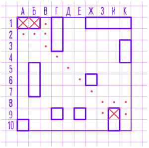
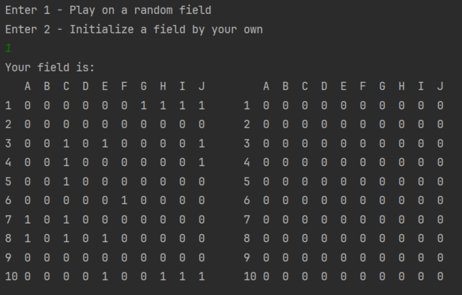

# Battleship

## Table of Contents
* [General Info](#general-information)
* [Technologies Used](#technologies-used)
* [Features](#features)
* [Screenshots](#screenshots)
* [Project Status](#project-status)

## General Information
**Battleship** (also Battleships or Sea Battle) is a guessing game for two players. 
Each player has a 10x10 grid containing several "ships" and objective is to destroy enemy's forces by targetting individual cells on his field. 
The ship occupies one or more cells in the grid. Size and number of ships may differ from version to version. 
In this program I implemented Soviet/Russian version of the game.

## Technologies Used
Project is created with:

- Java - version 17

## Features
- Initialize a field by your own or play on a random field
- Play with AI
- Included field validator to check the field initialized by a player

## Screenshots

## Project Status
Project is: _completed_ 
